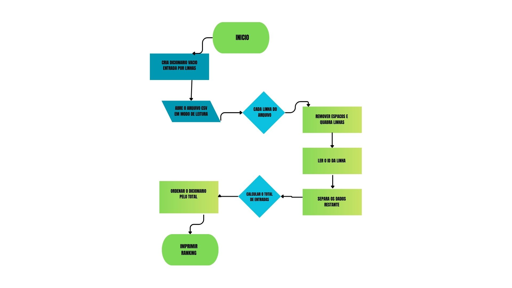
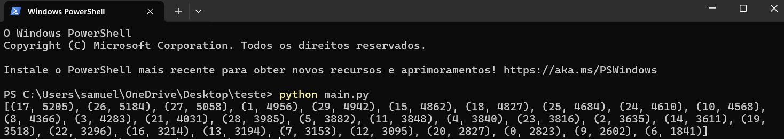

# Algoritmo Contador de Passageiros

## Justificativa
O presente algoritmo foi desenvolvido para atender à necessidade da prefeitura e da empresa de transporte do município em identificar as linhas de ônibus com maior volume de passageiros.  

Em horários de pico, algumas linhas ficam sobrecarregadas, causando desconforto para os usuários e comprometendo a eficiência do sistema de transporte público. A proposta é fornecer uma ferramenta confiável que utilize os dados coletados por sensores e câmeras instalados nos ônibus para contabilizar o fluxo de passageiros.  

Com base nesses dados, será possível gerar um **ranking das linhas mais movimentadas**, fornecendo à gestão informações seguras para direcionar o investimento em novas unidades de transporte. Dessa forma, evita-se gastos desnecessários e garante-se que os recursos públicos sejam aplicados de forma eficiente e estratégica.

### Pontos Fundamentais
- **Necessidade de dados confiáveis para decisões de investimento**: garante que a escolha das linhas a receber novos ônibus seja feita com base em evidências concretas.  
- **Apoio à mobilidade urbana inteligente**: contribui para um transporte público mais eficiente, moderno e integrado às demandas reais da população.


## Fluxograma do Algoritmo

Abaixo está o fluxograma que representa as etapas do algoritmo:




## Algoritmo

A seguir está o código-fonte principal do algoritmo desenvolvido (`main.py`):

```python
# main.py
# Descrição: Algoritmo para contabilizar passageiros em linhas de ônibus,
# identificar quais linhas possuem maior demanda e gerar um ranking.

entradas_por_linha = {}  

with open('out.csv', 'r') as arquivo:
    for linha in arquivo:
        linha_limpa = linha.strip()
        id_linha = int(linha_limpa.split(",", 1)[0])
        dados = linha_limpa.split(",", 1)[1]
        pares = dados.split(",")
        total_entradas = sum(int(pass_.split(":")[0]) for pass_ in pares)
        entradas_por_linha[id_linha] = entradas_por_linha.get(id_linha, 0) + total_entradas

ranking = sorted(entradas_por_linha.items(), key=lambda item: item[1], reverse=True)
print(ranking)
```


## Linguagem Utilizada
O algoritmo foi desenvolvido em **Python 3.11.9**, garantindo compatibilidade com as versões mais recentes da linguagem.

## IDE Utilizada
O desenvolvimento foi realizado no **Visual Studio Code (VS Code)**, proporcionando suporte a sintaxe, depuração e execução integrada do código Python.

## Infraestrutura de Arquivos Necessária
Para o correto funcionamento do algoritmo, os seguintes arquivos devem estar presentes na mesma pasta:

- **out.csv** → arquivo de entrada contendo os dados do fluxo de passageiros em cada linha de ônibus.  
- **main.py** → arquivo contendo o algoritmo principal.  

## Instruções de Execução
Siga os passos abaixo para executar o algoritmo:

1. Certifique-se de que o **Python 3.11.9** esteja instalado em seu sistema.  
2. Coloque o arquivo **out.csv** na mesma pasta do **main.py**.  
3. Abra o terminal ou prompt de comando na pasta do projeto.  
4. Execute o programa com o comando:  

```bash
python main.py
```

## Resultados Esperados

Após a execução do algoritmo `main.py`, o programa exibirá no terminal o **ranking das linhas de ônibus**, do maior para o menor volume de passageiros.  

Exemplo de saída no console:

