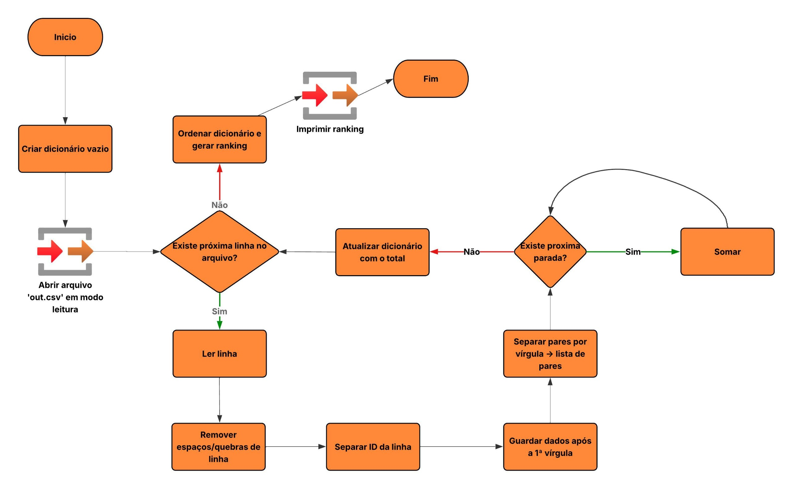

# Algoritmo Contador de Passageiros

## Justificativa
O presente algoritmo foi desenvolvido para atender à necessidade da prefeitura e da empresa de transporte do município em identificar as linhas de ônibus com maior volume de passageiros.  

Em horários de pico, algumas linhas ficam sobrecarregadas, causando desconforto para os usuários e comprometendo a eficiência do sistema de transporte público. A proposta é fornecer uma ferramenta confiável que utilize os dados coletados por sensores e câmeras instalados nos ônibus para contabilizar o fluxo de passageiros.  

Com base nesses dados, será possível gerar um **ranking das linhas mais movimentadas**, fornecendo à gestão informações seguras para direcionar o investimento em novas unidades de transporte. Dessa forma, evita-se gastos desnecessários e garante-se que os recursos públicos sejam aplicados de forma eficiente e estratégica.

### Pontos Fundamentais
- **Necessidade de dados confiáveis para decisões de investimento**: garante que a escolha das linhas a receber novos ônibus seja feita com base em evidências concretas.  
- **Apoio à mobilidade urbana inteligente**: contribui para um transporte público mais eficiente, moderno e integrado às demandas reais da população.

## Fluxograma do Algoritmo

Abaixo está o fluxograma que representa as etapas do algoritmo:

